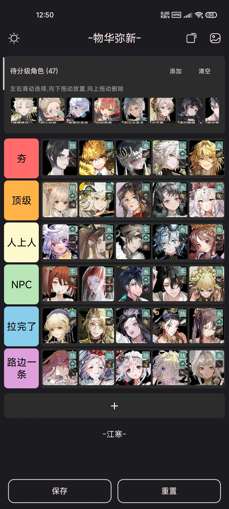
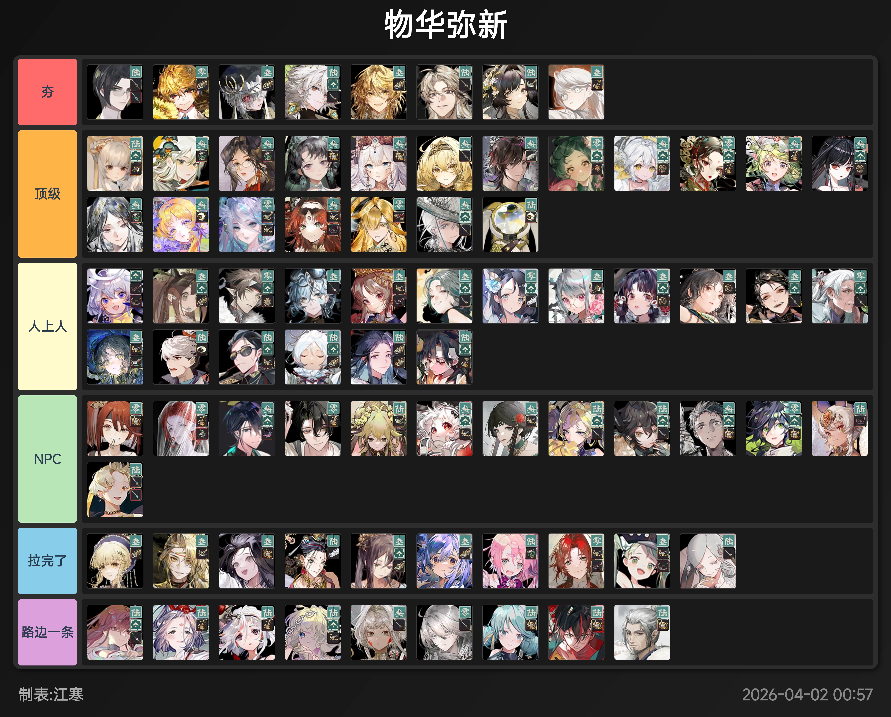

# Tier-Master (梯度大师)

一款专业的梯度表/排行榜编辑工具，基于 Jetpack Compose 与 Material3 构建，支持批量图片管理、自定义层级、主题切换等功能。

## 应用预览

<p align="center">
  
</p>

## 生成效果示例

<p align="center">
  
</p>

> 上图是使用梯度大师生成的《物华弥新》角色梯度表，展示了应用的实际输出效果。

## 功能特性

### 梯度表编辑

- 创建与导出专业梯度表/排行榜图片
- 自由添加、删除、重命名、拖拽排序层级行
- 层级颜色自定义，内置 S/A/B/C/D 四档配色，支持十六进制色值输入
- 编辑梯度表标题与作者信息
- 滑动删除层级行

### 图片管理

- 批量从相册导入图片（Android Photo Picker）
- 拖拽放置图片至层级行，支持跨层级垂直拖拽
- 双击选择图片，再次双击交换位置（支持跨层级）
- 单击打开操作菜单：查看、裁切、移动、替换、重命名、设置小图标
- 图片裁切：1:1、3:4 比例或自定义像素尺寸
- 全尺寸图片查看，显示分辨率信息
- 图片移动至其他层级或调整层内位置（左/右/首/末）
- 图片命名，可选择名称显示在图片下方或叠加层
- 导入时自动转换为 WebP 格式（质量 85），节省存储空间
- 导入时基于 xxHash64 内容哈希去重

### 小图标系统

- 每张图片最多添加 3 个小图标
- 支持叠加模式（图标覆盖在图片上）与外置模式（图标排列在图片旁）
- 从相册或图包导入小图标
- 小图标管理：添加、删除，防止删除正在使用的小图标
- 一键复制：将某图片的小图标应用到同层级所有图片

### 图包管理

- 导入 ZIP 格式图包，支持密码保护的压缩包（zip4j）
- 导入时自动去重与 WebP 转换
- 选择导入目标：待选图片区或小图标区
- 导出图包为 WebP 优化的 ZIP 文件
- 图包管理对话框：列表、导入、导出、删除

### 预设系统

- 保存当前梯度表配置为 `.tdds` 预设文件
- 浏览与加载已保存预设
- 导入/导出 `.tdds` 文件（内含配置 JSON 与图片资源的 ZIP）
- 预设名称冲突检测，支持覆盖或新建
- 离开应用时自动保存草稿，下次启动可恢复
- 支持通过文件关联直接打开 `.tdds` 文件

### 位图生成

- 生成高质量梯度表图片：渐变背景、卡片阴影、圆角、层级标签
- 深色/浅色主题渲染，预览时可切换
- 每行最多 12 张图片，自动换行
- 自定义字体渲染标签与标题
- 图片名称叠加或下方显示
- 小图标圆角渲染与 PorterDuff 遮罩
- 保存至相册（MediaStore）或通过系统分享

### 程序设置

- 运行时切换语言（10 种语言）
- 浅色/深色主题切换，支持跟随系统
- 自定义字体开关
- 点击添加行为开关
- 小图标外置模式开关
- 图片名称位置切换
- 拖拽预览偏移量调整（水平 0-300dp，垂直 0-150dp）

### 资源管理

- 存储占用展示：缓存、工作图片、图包、草稿、预设
- 缓存清理：清除缓存、工作图片、草稿，保留图包与预设
- 日志文件 7 天自动清理，3 天轮转

## 技术栈

| 类别 | 技术 |
|------|------|
| 语言 | Kotlin 2.3.21 |
| UI 框架 | Jetpack Compose (BOM 2026.05.01) + Material3 |
| 构建 | AGP 9.2.1, Gradle, refreshVersions |
| 图片加载 | Coil 3.4.0 (Ktor 网络层) |
| 压缩处理 | Apache Commons Compress 1.28.0, zip4j 2.11.6 |
| 图片裁切 | easycrop 0.1.1 |
| 拖拽排序 | reorderable 3.1.0 |
| 代码规范 | ktlint 1.2.1 |
| 许可证 | Apache-2.0 |

## 运行环境

| 属性 | 值 |
|------|-----|
| applicationId | com.tdds.jh |
| versionName | 1.0.0 |
| compileSdk | 36 |
| minSdk | 31 (Android 12) |
| targetSdk | 36 |
| NDK | arm64-v8a |
| Java | 21 |

## 签名配置

构建 Release 版本需要配置签名密钥。在项目根目录创建 `local.properties` 文件并添加以下配置：

```properties
KEYSTORE_PASSWORD=your_keystore_password
KEY_ALIAS=your_key_alias
KEY_PASSWORD=your_key_password
```

同时确保密钥库文件 `your_key.keystore` 位于项目根目录。如果密钥库文件名或路径不同，请修改 `app/build.gradle.kts` 中的 `storeFile` 配置。

**注意**：`local.properties` 和密钥库文件已添加到 `.gitignore`，不会被提交到版本控制。

## 支持语言

简体中文、English、日本語、한국어、Русский、Deutsch、Francais、Espanol、العربية、Portugues

共 10 种语言，支持运行时切换，首次启动自动匹配系统语言。

## 打赏支持

如果这个项目对你有帮助，欢迎请作者喝杯咖啡。

<table>
  <tr>
    <td align="center">
      <br/>
      <b>支付宝</b>
    </td>
    <td align="center">
      <br/>
      <b>微信支付</b>
    </td>
  </tr>
</table>
